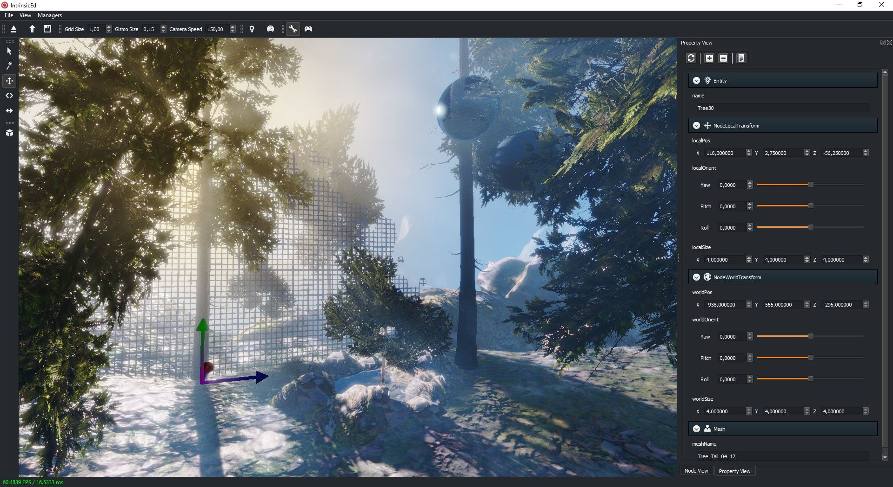

# Intrinsic

[](https://github.com/begla/Intrinsic/issues) [](https://gitter.im/Intrinsic-Engine/Lobby?utm_source=badge&utm_medium=badge&utm_campaign=pr-badge&utm_content=badge)

Intrinsic is a Vulkan based cross-platform game and rendering engine. The project is currently in an early stage of development but evolves rapidly from day to day.



# Getting started

## Prerequisites

* Visual Studio 2015
* CMake >= 3.5
* Qt 5.7
* Vulkan SDK 1.0.26.0
* PhysX 3.3
* FBX SDK 2015.1

## Windows

```
1. Download and install the latest Qt 5.x (open-source) distribution
2. Create a new environment variable "INTR_QTDIR" pointing to "[...]\Qt5.7\5.7\msvc2015_64"

3. Download an install Vulkan SDK 1.0.26.0: https://vulkan.lunarg.com/

4. Get access to the latest PhysX SDK from NVIDIA: https://developer.nvidia.com/physx-sdk
5. Follow the instructions from NVIDIA and compile the PhysX libraries for the configurations "Release", "Profile" and "Debug"
   NOTE: Make sure that PhysX links the Runtime Library dynamically as Intrinsic does!
6. Download and install the latest Autodesk FBX SDK (2015.1): http://usa.autodesk.com/adsk/servlet/pc/item?siteID=123112&id=10775847
7. Create a new directory called "Intrinsic_Dependencies" on the same level as the Intrinsic repository folder
8. Inside, create a new folder "dependencies" containing two folders "physx" and "fbx"
9. Copy the static/dynamic libraries and header files of both SDKs to folders named "bin" (DLLs), "lib" (LIBs) and "include" respectively

10. Go to the "scripts_win32" folder in the Intrinsic repository dir
11. Execute "ConfigAndBuildDependencies.bat" to build some of the remaining dependencies automatically
12. Execute "CopyDllsToAppDir_Debug.bat" and "CopyDllsToAppDir_Release.bat"
13. Execute "Config.bat" to create a Visual Studio 2015 solution file and all project configurations

14. If everything went well, you'll find the solution in the newly created "build" folder. You can also use one of the many build scripts: "Build_Release.bat", ... to get started
15. Execute "Intrinsic.exe" or "IntrinsicEd.exe" in the "app" directory - yey!
```

## Linux

Coming soon...

# Build Status

| Platform | Build Status |
|:--------:|:------------:|
| Windows  | Coming soon... |
| Linux    |  [](https://travis-ci.org/begla/Intrinsic) |
| Android  | Coming soon... |

# License

```
// Copyright 2016 Benjamin Glatzel
//
// Licensed under the Apache License, Version 2.0 (the "License");
// you may not use this file except in compliance with the License.
// You may obtain a copy of the License at
//
//    http://www.apache.org/licenses/LICENSE-2.0
//
// Unless required by applicable law or agreed to in writing, software
// distributed under the License is distributed on an "AS IS" BASIS,
// WITHOUT WARRANTIES OR CONDITIONS OF ANY KIND, either express or implied.
// See the License for the specific language governing permissions and
// limitations under the License.
```

# Credits

Intrinsic uses the following open-source libraries:

* Qt (IntrinsicEd only, see https://www.qt.io/download)
* SDL 2.0 (see https://www.libsdl.org/download-2.0.php)
* Vulkan SDK (see https://lunarg.com/vulkan-sdk/)
* tlsf (see https://github.com/mattconte/tlsf)
* microprofile (https://github.com/jonasmr/microprofile)
* enkiTS (see https://github.com/dougbinks/enkiTS)
* gli (see http://gli.g-truc.net/0.8.1/index.html)
* glm (see http://glm.g-truc.net/0.9.8/index.html)
* glslang (see https://github.com/KhronosGroup/glslang)
* SPIRV-Cross (see https://github.com/KhronosGroup/SPIRV-Cross)
* LuaJIT (see http://luajit.org/)
* rapidjson (see https://github.com/miloyip/rapidjson)
* rlutil (see https://github.com/tapio/rlutil)
* SOL 2 (see https://github.com/ThePhD/sol2)
* sparsepp (see https://github.com/greg7mdp/sparsepp)
* tinydir (see https://github.com/cxong/tinydir)

Intrinsic uses the following proprietary libraries:

* PhysX 3 (see https://developer.nvidia.com/physx-sdk)
* FBX SDK (IntrinsicEd only, see http://usa.autodesk.com/adsk/servlet/pc/item?siteID=123112&id=10775847)

Intrinsic also uses the following tools in binary format:

* NVTT (see https://developer.nvidia.com/gpu-accelerated-texture-compression)
* Cloc (see http://cloc.sourceforge.net)
* 7za (see http://www.7-zip.org/download.html)
