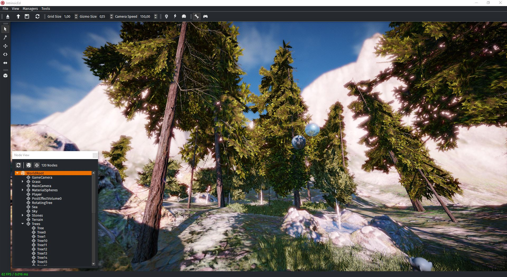
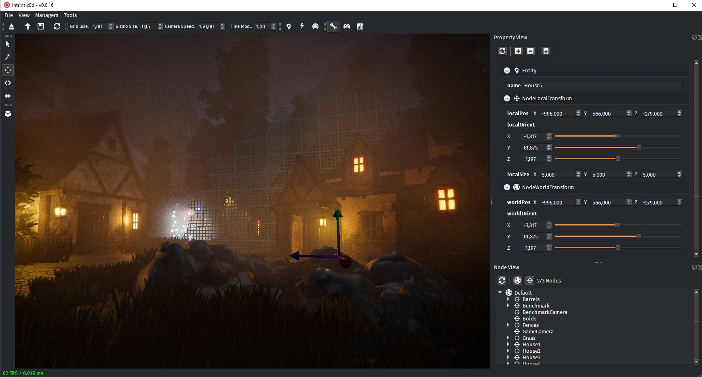
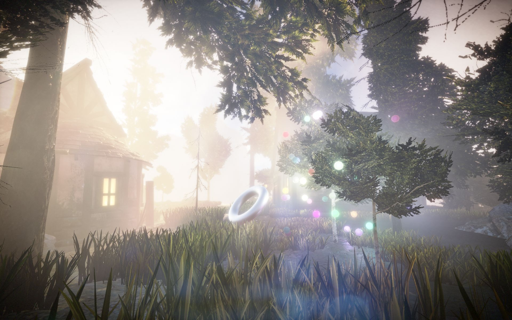
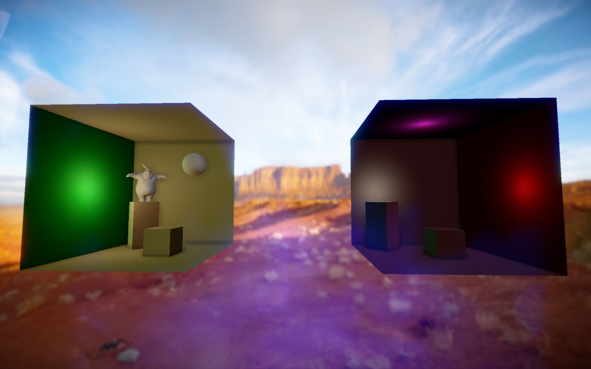

<p align="center">

</p>

# Intrinsic

[](https://github.com/begla/Intrinsic/issues) <a href='https://ko-fi.com/A815CV2' target='_blank'></a>

**NOTE:** *I'm working on this project in my sparetime and thus the development activity might vary from time to time. This project is not abandoned and I'm certainly planning to continue working on it in the future.*

Intrinsic is a Vulkan based cross-platform game and rendering engine. The project is currently in an early stage of development.

The Intrinsic repository is hosted on [GitHub](http://www.github.com/begla/Intrinsic). You can find some simple build and setup instructions in `GETTING_STARTED.md`.

Contributions and general support are welcome at any time.

# Build Status

| Platform | Build Status |
|:--------:|:------------:|
| Windows (Visual Studio 2017) | [](https://ci.appveyor.com/project/begla/intrinsic) |
| Linux (GCC 6.0 / Clang 4.0) | [](https://travis-ci.org/begla/Intrinsic) |

# Screenshots






# License

```
// Copyright 2017 Benjamin Glatzel
//
// Licensed under the Apache License, Version 2.0 (the "License");
// you may not use this file except in compliance with the License.
// You may obtain a copy of the License at
//
//    http://www.apache.org/licenses/LICENSE-2.0
//
// Unless required by applicable law or agreed to in writing, software
// distributed under the License is distributed on an "AS IS" BASIS,
// WITHOUT WARRANTIES OR CONDITIONS OF ANY KIND, either express or implied.
// See the License for the specific language governing permissions and
// limitations under the License.
```
