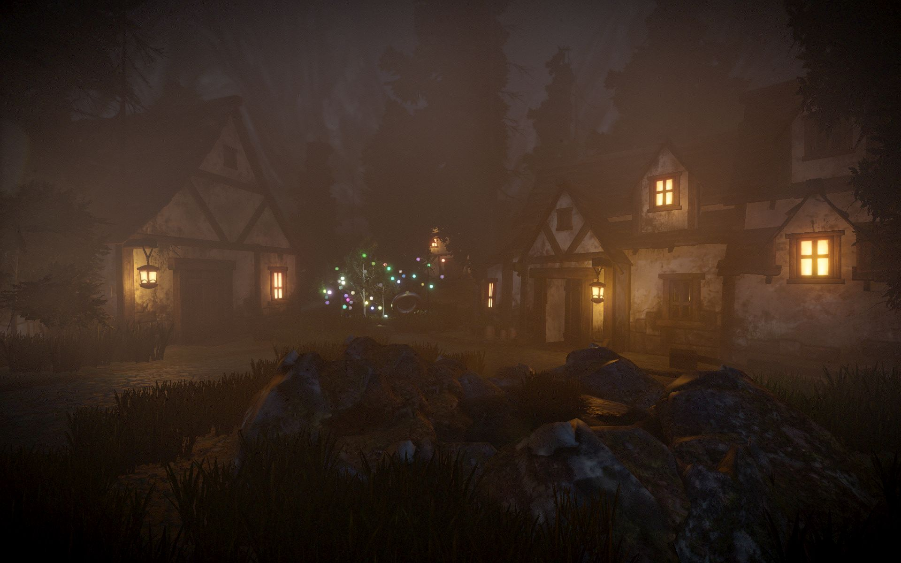
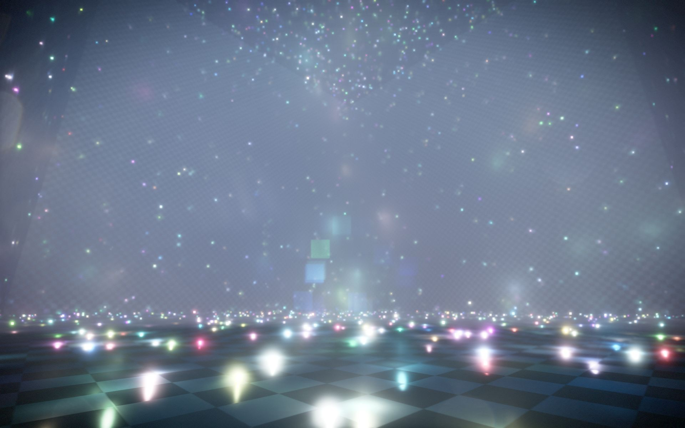

[](https://github.com/begla/Intrinsic/issues) [](https://gitter.im/Intrinsic-Engine/Lobby?utm_source=badge&utm_medium=badge&utm_campaign=pr-badge&utm_content=badge)

# Intrinsic


Intrinsic is a Vulkan based cross-platform game and rendering engine. The project is currently in an early stage of development.

You can find some simple build and setup instructions in `GETTING_STARTED.md`.

Further details are available on the project homepage (see http://www.intrinsic-engine.com). The Intrinsic repository is hosted on GitHub (see http://www.github.com/begla/Intrinsic).

# Screenshots






# Build Status

| Platform | Build Status |
|:--------:|:------------:|
| Windows  | [](https://ci.appveyor.com/project/begla/intrinsic) |
| Linux    |  [](https://travis-ci.org/begla/Intrinsic) |

# License

```
// Copyright 2016 Benjamin Glatzel
//
// Licensed under the Apache License, Version 2.0 (the "License");
// you may not use this file except in compliance with the License.
// You may obtain a copy of the License at
//
//    http://www.apache.org/licenses/LICENSE-2.0
//
// Unless required by applicable law or agreed to in writing, software
// distributed under the License is distributed on an "AS IS" BASIS,
// WITHOUT WARRANTIES OR CONDITIONS OF ANY KIND, either express or implied.
// See the License for the specific language governing permissions and
// limitations under the License.
```

# Credits

Intrinsic uses the following open-source libraries:

* Qt (IntrinsicEd only, see https://www.qt.io/download)
* SDL 2.0 (see https://www.libsdl.org/download-2.0.php)
* Vulkan SDK (see https://lunarg.com/vulkan-sdk/)
* tlsf (see https://github.com/mattconte/tlsf)
* microprofile (https://github.com/jonasmr/microprofile)
* enkiTS (see https://github.com/dougbinks/enkiTS)
* gli (see http://gli.g-truc.net/0.8.1/index.html)
* glm (see http://glm.g-truc.net/0.9.8/index.html)
* glslang (see https://github.com/KhronosGroup/glslang)
* SPIRV-Cross (see https://github.com/KhronosGroup/SPIRV-Cross)
* LuaJIT (see http://luajit.org/)
* rapidjson (see https://github.com/miloyip/rapidjson)
* rlutil (see https://github.com/tapio/rlutil)
* SOL 2 (see https://github.com/ThePhD/sol2)
* sparsepp (see https://github.com/greg7mdp/sparsepp)
* tinydir (see https://github.com/cxong/tinydir)

Intrinsic uses the following proprietary libraries:

* PhysX 3 (see https://developer.nvidia.com/physx-sdk)
* FBX SDK (IntrinsicEd only, see http://usa.autodesk.com/adsk/servlet/pc/item?siteID=123112&id=10775847)
* BugSplat (see http://www.bugsplat.com/)

... and the following tools in binary format:

* NVTT (see https://developer.nvidia.com/gpu-accelerated-texture-compression)
* Cloc (see http://cloc.sourceforge.net)
* 7za (see http://www.7-zip.org/download.html)

Assets and icons sourced from:

* https://cloud.blender.org/
* http://www.hdrlabs.com/sibl/archive.html
* http://www.flaticon.com
* http://www.gametextures.com
